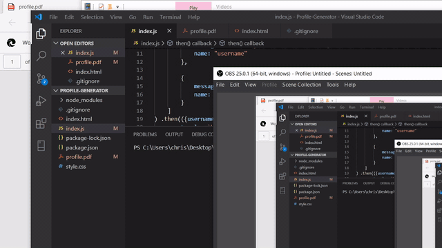

Profile Generator

Creates a profile in a PDF file from a users github account. 

Inquirer is used to prompt the user for their github name and favorite color. 

The appliction parses data from the github api using the github name and populates 

the PDF with the users data. An html template is used to layout the data. 

